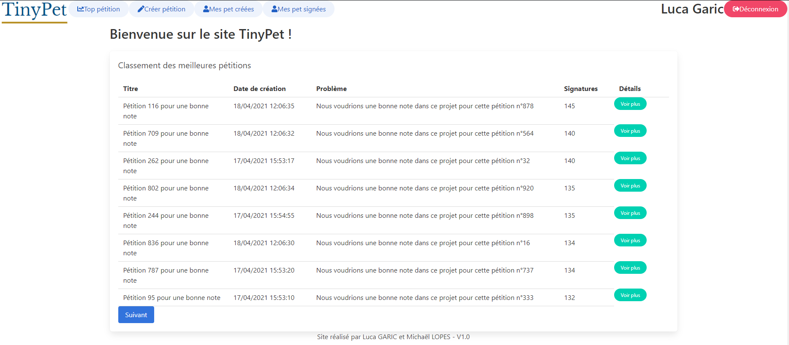
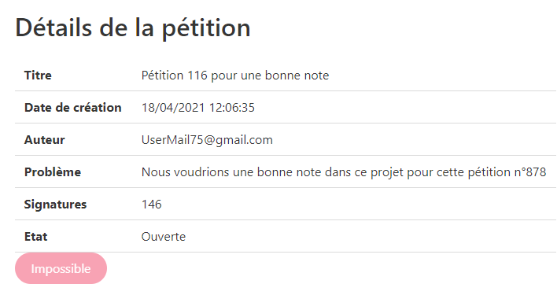
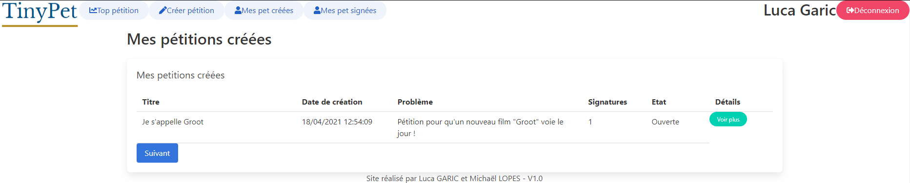
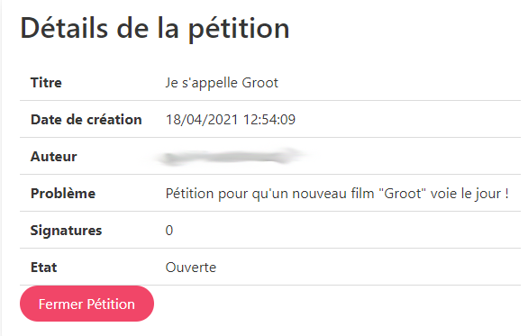

# Projet TinyPet

## Introduction

Ce projet a été réalisé par Luca GARIC et Michaël LOPES en M1 MIAGE Classique.

L’objectif de ce projet est de réaliser une application Web ressemblant à un site de pétition, c’est-à-dire la création et la signature de pétition.

Ce document est divisé en plusieurs sections. Vous trouverez les liens de notre application, les fonctionnalités implémentées, le fonctionnement de l’application, les entités de notre base de données, les temps d’exécution de l’application, les fonctionnalités non implémentées et pour terminer une conclusion.

## Les liens

* Lien vers [l'application](https://projetwebcloud.ew.r.appspot.com/)
* Lien vers le [portail de l'API](https://endpointsportal.projetwebcloud.cloud.goog/)
* Lien vers le [Github](https://github.com/mlopesstage/ProjetWebCloud)

## Fonctionnalités implémentées

Ci-dessous la liste de toutes les implémentations : 
* Créer / Signer / **Fermer (seulement pour l’auteur de la pétition)** une pétition
* Se connecter (avec google oauth2)
* Afficher un classement des meilleures pétitions triées par date la plus récente *(cette page fait office de page d’accueil de l’application)*
* Consulter ses pétitions créées
* Consulter ses pétitions signées
* Afficher le détail d’une pétition
* Se déconnecter avec redirection vers la page d’accueil

## Fonctionnement

Nous avons donc travaillé avec un système d’endpoint dans une classe java. C’est dans cette classe que toutes nos requêtes sont effectuées, nous effectuons ensuite des appels REST dans les différentes vues codées en Mithrils dans notre application. 
Nous avons donc utilisé Mithril pour animer notre site. Cependant, nous avons fonctionné de manière à séparer les vues dans différents fichiers HTML et non pas en un fichier unique comme l’exige Mithril. Cette façon de procéder est dûe à notre méconnaissance de la technologie Mithril, nous étions partis très tôt dans le projet dans ce mode de fonctionnement de séparer les affichages en plusieurs vues différentes. Nous avons compris assez tard l’intérêt d’utiliser le framework Mithril. 
Concernant le fonctionnement général du site, nous avons tout d’abord mis un point d’honneur à gérer la sécurité, de ce fait nous avons géré le fait qu’un utilisateur déconnecté ne puisse pas accéder à des pages où il est censé être connecté.

L’utilisateur déconnecté a donc accès à :
* L’accueil, où il peut consulter le classement des pétitions les plus signées
* Le détail d’une pétition **(cependant, il ne peut pas signer)**

Afin d’aider notre site à passer à l’échelle nous avons mis en place un système de pagination. Dans une limite de dix éléments, il est possible de charger les dix éléments suivants dans la requête effectuée à l’aide d’un bouton “Suivant”.  
Cette fonctionnalité est présente sur :
* L’accueil, ce qui permet notamment de ne pas charger 100 pétitions en une seule requête (mais de les charger successivement 10 par 10).
* Mes pétitions créées et mes pétitions signées, dans ces deux vues nous avons aussi choisi de charger les pétitions 10 par 10 avec notre pagination dans le sens où en l’absence de restrictions d’affichage, ces requêtes ne passeront pas à l’échelle (notamment pour les pétitions signées d’un utilisateur où le nombre peut être assez conséquent).

Notre application possède aussi un formulaire de création :

L’auteur de chaque pétition a donc la possibilité de la fermer, ce qui exclut l’opportunité de la signer pour les autres utilisateurs :

Enfin, comme nous l’avons mentionné au début de la partie fonctionnalité, un utilisateur non connecté voit sa navigation être restreintes, il n’a aussi pas la possibilité de signer une pétition :

## Fonctionnement

Table “Petition” :

Ci-dessus une capture d'écran de notre entité pétition, ce qui est notable ici est le fait que nous ayons salé la clé de chaque entrée pour faire en sorte de trier les pétitions par date de création (les plus récentes en premières). Ça nous permet notamment de nous affranchir d’index composites sur la requête d’affichage de top pétitions à l’accueil. 
Les utilisateurs étant gérés par google oauth2, nous n’avons pas d’entité de ce nom dans notre base.

## Temps d’exécution

Les différents tests ont été réalisés 50 fois, sauf la création d’une pétition qui a été réalisée 10 fois. Les temps indiqués correspondent à la latence moyenne des 50 exécutions indiquées sur Google Cloud Platforme. 

* Top pétitions (150 lors du test) : 400,012 ms
* Créer pétition : 139,273 ms
* Mes pétitions signées (10 lors du test) : 367,034 ms
* Mes pétitions créées (10 lors du test) : 305,818 ms
* Détails d’une pétition : 82,7 ms

## Fonctionnalités non implémentées

Globalement, le site respecte toutes les implémentations prévues lors du début du projet. 
Nous tenons à mentionner que le système de tag optionnel n’a pas été implémenté, cela s’explique majoritairement par manque de temps. Il est vrai que nous avons été confrontés à des problèmes assez chronophages comme le passage de valeurs entre les différentes vues.

## Conclusion

Comme nous venons de le mentionner, il est assez regrettable d’avoir perdu du temps sur certaines fonctionnalités assez triviales au final (surtout si l’on avait codé comme Mithril le voulait en système de route). Cependant, toutes les fonctionnalités de base sont implémentées avec la gestion des exceptions dans le cas où l’utilisateur est connecté / déconnecté. 
Nous avons aussi eu besoin de nous documenter sur le framework utilisé et sur certaines fonctions en général (comme la connexion par exemple). Ce fut assez formateur dans l’ensemble. Il est important de gérer plusieurs détails pour faire passer l’application à l’échelle (implémentation d’une pagination, sélection précise d’attribut lors d’une requête). 
Pour finir nous avons identifié plusieurs axes d’améliorations pour rendre notre projet plus interactif et pour le faire mieux passer à l’échelle :
* Implémentation d’une recherche précise d’une pétition.
* Sélectionner des attributs précis de l’entité sur chaque requête (et donc potentiellement exclure la liste de signataires d’une pétition quand elle n’est pas utile).  
* Recherche par tags
* Pouvoir se désister d’une pétition (revenir sur sa signature)